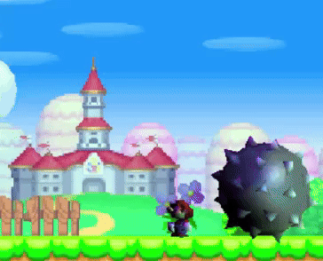

# Custom Lighting



### Core files
* **extralighting.cpp** - DO modify this; new and old lighting profiles are defined in the LightingProfiles array
* **extralighting.hpp** - DO NOT modify unless you know what you are doing

*OR*
* **legacy/extralighting.cpp** - a less intrusive and possibly more safe method of adding and modifying lighting profiles\
BUT, since it does nothing else but extend the game's light profile table:
	- you can only use one directional light (DS hardware can handle four)
	- you cannot set specular
	- you cannot use LightGod

### Optional
* **lightgod.cpp/hpp** (*Requires extralighting.hpp/cpp*) - An actor that can modify lighting during runtime; can be triggered by events, interpolate between lighting profiles, and trigger or deactivate an event when finished\
Currently replaces actor 46 (stage object 44), however, it can be easily modified to replace any; if you need help with this let me know.

If you wish to view LightGod's settings within NSMBe, paste this in stageobjsettings_new.xml
```xml
<class id="46">
  <name>Light God</name>
  <flags known="1" complete="0" />
  <category id="21" />
  <notes></notes>
  <files></files>
  <field id="41-48" type="value" name="Light profile ID" values="" notes="Light profile to switch to" />
  <field id="33-40" type="value" name="Transition length" values="" notes="Time it takes to switch light profiles (frames*5)" />
  <field id="32" type="checkbox" name="Single use" values="1" notes="If set actor is destroyed after being triggered once" />
  <field id="1-8" type="value" name="Trigger ID" values="" notes="" />
  <field id="9-16" type="value" name="Target ID" values="" notes="" />
  <field id="28" type="list" name="Switch mode" values="0=Activates target,1=Deactivates target" notes="If a target ID is set" />
</class>
```

### Extras
* **worldmaplighting.cpp** - lets you set worldmap lighting for each world
* **titlescreenlighting.cpp** - lets you set titlescreen lighting


* **tools/re.js** - [a tool to visualize and create light profiles](https://pete420griff.github.io/nsmb-stuff/)

---

How to make your new lighting profiles show in NSMBe: 
1. Navigate to and open [NSMBe root]/Languages/[your language].ini
2. Find the 3D lighting list (LIST_3DLighting)
3. Add your new light setting slot names to the bottom of the list
